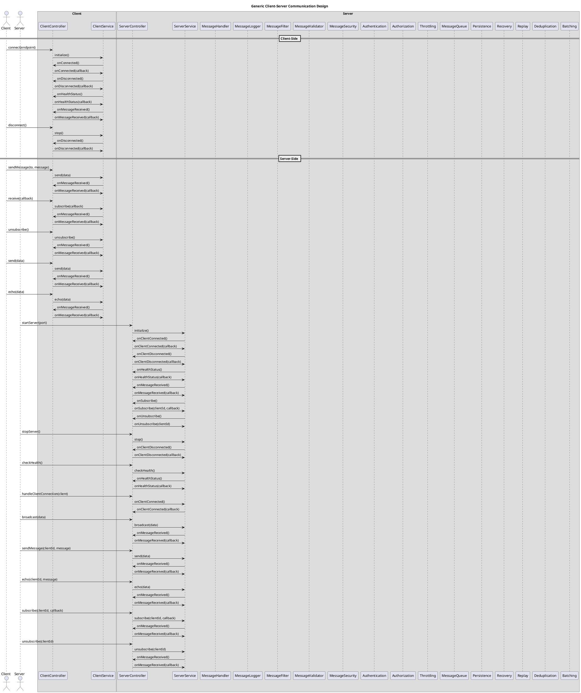

# {{ TOPIC }} <!-- omit in toc -->

- [](#)
- [Use Cases](#use-cases)
  - [Client-Side Actions](#client-side-actions)
  - [Server-Side Actions](#server-side-actions)
- [Core Components and Interfaces](#core-components-and-interfaces)
- [Supported Protocols](#supported-protocols)
- [Typescript Interfaces](#typescript-interfaces)
  - [Client-side generic design (Typescript)](#client-side-generic-design-typescript)
  - [Server-side generic design (Typescript)](#server-side-generic-design-typescript)
  - [Message format (Typescript)](#message-format-typescript)
- [Golang Interfaces](#golang-interfaces)
  - [Client-side generic design (Golang)](#client-side-generic-design-golang)
  - [Server-side generic design (Golang)](#server-side-generic-design-golang)
  - [Message format (Golang)](#message-format-golang)
- [Message Handlers](#message-handlers)
- [Implementation](#implementation)
- [High-level design](#high-level-design)
- [Reference](#reference)

---

## [](<URL>)

To provide a generic interface for client-server communication, we need to define the following:

- Client-side generic design
- Server-side generic design
- Message format
- Message types
- Message handlers
- Message routing
- Message logging
- Message filtering
- Message validation
- Message encryption
- Message compression
- Message authentication
- Message authorization
- Message throttling
- Message queueing
- Message persistence
- Message recovery
- Message replay
- Message deduplication
- Message batching

The client-side generic design is implemented by the client controller and client service. The server-side generic design is implemented by the server controller and server service. The message format, message types, message handlers, message routing, message logging, message filtering, message validation, message encryption, message compression, message authentication, message authorization, message throttling, message queueing, message persistence, message recovery, message replay, message deduplication, and message batching are implemented by the client and server controllers and services.

## Use Cases

The design is to support the following use cases:

### Client-Side Actions

- Connect to the server.
- Disconnect from the server.
- Subscribe to receive messages from the server.
- Unsubscribe from receiving messages from the server.
- Send a message to the server.
- Receive messages from the server.
- Send a message to another client.
- Receive messages from other clients.

### Server-Side Actions

- Send messages to clients.
- Receive messages from clients.
- Broadcast messages to clients.
- Send messages to other servers.
- Receive messages from other servers.
- Broadcast messages to servers.
- Send messages to both clients and servers.
- Receive messages from both clients and servers.
- Broadcast messages to both clients and servers.

---

## Core Components and Interfaces

1. **Client-side generic design**
 
   - Interface: `ClientControllerInterface` and `ClientServiceInterface`
   - Responsibilities: Handling client connections, messages, and health status.

2. **Server-side generic design**
 
   - Interface: `ServerControllerInterface` and `ServerServiceInterface`
   - Responsibilities: Managing server behavior, client connections, broadcasting, and server health status.

3. **Message Format**
 
   - Interface: `MessageInterface`
   - Responsibilities: Defining the structure of messages, including sender, recipient, content, and metadata.

4. **Message Handling**
 
   - Interface: `MessageHandlerInterface`
   - Responsibilities: Handling the processing and routing of messages.

5. **Message Logging**
 
   - Interface: `MessageLoggerInterface`
   - Responsibilities: Logging messages for monitoring and auditing purposes.

6. **Message Filtering**
 
   - Interface: `MessageFilterInterface`
   - Responsibilities: Filtering messages based on criteria like content or sender.

7. **Message Validation**
 
   - Interface: `MessageValidatorInterface`
   - Responsibilities: Validating incoming and outgoing messages for format and content.

8. **Message Encryption and Compression**
 
   - Interface: `MessageSecurityInterface`
   - Responsibilities: Implementing encryption and compression for secure communication.

9. **Message Authentication and Authorization**
 
   - Interface: `AuthenticationInterface` and `AuthorizationInterface`
   - Responsibilities: Authenticating clients and authorizing message actions.

10. **Message Throttling**
 
    - Interface: `ThrottlingInterface`
    - Responsibilities: Implementing rate limiting or message throttling.

11. **Message Queueing and Persistence**
 
    - Interface: `MessageQueueInterface` and `PersistenceInterface`
    - Responsibilities: Handling message queuing, storage, and retrieval.

12. **Message Recovery and Replay**
 
    - Interface: `RecoveryInterface` and `ReplayInterface`
    - Responsibilities: Supporting message recovery and replay mechanisms.

13. **Message Deduplication**
 
    - Interface: `DeduplicationInterface`
    - Responsibilities: Avoiding duplication of messages.

14. **Message Batching**
 
    - Interface: `BatchingInterface`
    - Responsibilities: Grouping messages for more efficient transmission.

## Supported Protocols

You can define protocol-specific implementations of the above interfaces for various communication protocols, such as Elasticsearch, GraphQL, gRPC, HTTP, Kafka, MQTT, NATS, RabbitMQ, Redis, REST, SOAP, Socket-IO, TCP, UDP, Webpush, Webhook, WebRTC, WebSockets, etc.

---

## Typescript Interfaces

### Client-side generic design (Typescript)

```typescript
// file: generic-client.interface.ts
interface GenericClientControllerInterface {
  connect(endpoint: string): Promise(<ConnectionInterface>); // Connect to a server at the specified endpoint
  disconnect(): void; // Disconnect from the server and stop the client
  checkHealth(): HealthStatusInterface; // Check the health of the connection to the server
  sendMessage(message: MessageInterface): void; // Send a directed message to a specific recipient
  send(message: MessageInterface): void; // Send a message to the server (broadcast)
  echo(message: MessageInterface): Promise<MessageInterface>; // Send a message and expect to receive the same message
  receive(callback: (data: any) => void): void; // Handle incoming messages from the server
  subscribe(callback: (subscription: SubscriptionInterface) => void): Promise<SubscriptionInterface>; // Handle incoming messages from the server
  unsubscribe(subscriptionID: string, clientID: string): void; // Stop handling incoming messages from the server
  register(registration: RegistrationInterface): Promise<RegistrationInterface>; // Register the client with the server
  unregister(subscriptionID: string, clientID: string): void; // Unregister the client from the server
  // listConnectedClients(): string[]; // List all connected clients
  // listDisconnectedClients(): string[]; // List all disconnected clients
  // listRegisteredClients(): string[]; // List all registered clients
  // listSubscribedClients(): string[]; // List all subscribed clients
}

interface GenericClientServiceInterface {
  initialize(): void; // Initialize the client
  onConnected(callback: () => void): void; // Handle connection to the server
  onDisconnected(callback: () => void): void; // Handle disconnection from the server
  onHealthStatus(callback: (healthStatus: HealthStatusInterface) => void): any; // Handle health status changes of the connection to the server
  onMessageReceived(callback: (from: string, message: string) => void): any; // Handle incoming messages from the server
  onTaskReceived(callback: (from: string, task: TaskInterface) => void): any; // Handle incoming tasks from the server
}
```

### Server-side generic design (Typescript)

```typescript
// file: generic-server.interface.ts
interface GenericServerControllerInterface {
  startServer(port: number): void; // Start the server on the specified port
  stopServer(): void; // Stop the server and disconnect all clients
  checkHealth(): HealthStatusInterface; // Check the health of the server
  handleClientConnection(client: any): any; // Handle a new client connection
  broadcast(data: any): void; // Send a message to all connected clients (broadcast)
  sendMessage(clientId: string, message: string): void; // Send a directed message to a specific client (unicast)
  echo(clientId: string, message: string): any; // Send a message and expect to receive the same message
  subscribe(clientId: string, callback: (from: string, message: string) => void): any; // Handle incoming messages from a specific client
  unsubscribe(clientId: string): void; // Stop handling incoming messages from a specific client
  register(clientId: string): TaskInterface; // Register a client with the server
  unregister(clientId: string): void; // Unregister a client from the server
  // listConnectedClients(): string[]; // List all connected clients
  // listDisconnectedClients(): string[]; // List all disconnected clients
  // listRegisteredClients(): string[]; // List all registered clients
  // listSubscribedClients(): string[]; // List all subscribed clients
}

interface GenericServerServiceInterface {
  initialize(): void; // Initialize the server (start listening for connections)
  onClientConnected(callback: (client: any) => void): any; // Handle new client connections
  onClientDisconnected(callback: (client: any) => void): void; // Handle client disconnections
  onHealthStatus(callback: (status: string) => void): any; // Handle health status changes of the server
  onMessageReceived(callback: (from: string, message: string) => void): any; // Handle incoming messages from clients
  onSubscribe(clientId: string, callback: (from: string, message: string) => void): any; // Handle incoming messages from a specific client
  onUnsubscribe(clientId: string): void; // Stop handling incoming messages from a specific client
  onRegister(clientId: string): any; // Register a client with the server
  onUnregister(clientId: string): void; // Unregister a client from the server
}
```

### Message format (Typescript)

```typescript
// file: message.interface.ts
// Message types
enum MESSAGE_TYPES {
  MESSAGE_TYPES_UNSPECIFIED = 'MESSAGE_TYPES_UNSPECIFIED', // Unspecified message type
  MESSAGE_TYPES_UNICAST = 'MESSAGE_TYPES_UNICAST', // Directed to a specific recipient
  MESSAGE_TYPES_BROADCAST = 'MESSAGE_TYPES_BROADCAST', // Sent to all connected clients
  MESSAGE_TYPES_ECHO = 'MESSAGE_TYPES_ECHO', // Sent to the sender
  MESSAGE_TYPES_HEALTH = 'MESSAGE_TYPES_HEALTH', // Health/status update (e.g., heartbeat)
  MESSAGE_TYPES_TASK = 'MESSAGE_TYPES_TASK', // Task to be executed by the recipient (e.g., execute, complete)
  MESSAGE_TYPES_CONNECTION = 'MESSAGE_TYPES_CONNECTION', // Connection to the server (e.g., connect, disconnect)
  MESSAGE_TYPES_SUBSCRIPTION = 'MESSAGE_TYPES_SUBSCRIPTION', // Subscription to receive messages from the server (e.g., subscribe, unsubscribe)
  MESSAGE_TYPES_REGISTRATION = 'MESSAGE_TYPES_REGISTRATION', // Registration with the server (e.g., register, unregister)
  MESSAGE_TYPES_SYSTEM = 'MESSAGE_TYPES_SYSTEM', // System message (e.g., error, warning)
  MESSAGE_TYPES_EVENT = 'MESSAGE_TYPES_EVENT', // Event message (e.g., webhook)
  UNRECOGNIZED = 'UNRECOGNIZED', // Unrecognized message type
}

// Action types
enum ACTION_TYPES {
  ACTION_TYPES_UNSPECIFIED = 'ACTION_TYPES_UNSPECIFIED',
  ACTION_TYPES_CONNECT = 'ACTION_TYPES_CONNECT', // Client connects to the server
  ACTION_TYPES_DISCONNECT = 'ACTION_TYPES_DISCONNECT', // Client or server disconnects
  ACTION_TYPES_REGISTER = 'ACTION_TYPES_REGISTER', // Client registers with the server
  ACTION_TYPES_UNREGISTER = 'ACTION_TYPES_UNREGISTER', // Client unregisters from the server
  ACTION_TYPES_SUBSCRIBE = 'ACTION_TYPES_SUBSCRIBE', // Client subscribes to receive messages
  ACTION_TYPES_UNSUBSCRIBE = 'ACTION_TYPES_UNSUBSCRIBE', // Client unsubscribes from receiving messages
  UNRECOGNIZED = 'UNRECOGNIZED',
}

enum STAGE_TYPES {
  STAGE_TYPES_UNSPECIFIED = 'STAGE_TYPES_UNSPECIFIED',
  STAGE_TYPES_DEVELOPMENT = 'STAGE_TYPES_DEVELOPMENT', // Development environment
  STAGE_TYPES_STAGING = 'STAGE_TYPES_STAGING', // Staging environment
  STAGE_TYPES_PRODUCTION = 'STAGE_TYPES_PRODUCTION', // Production environment
  UNRECOGNIZED = 'UNRECOGNIZED',
}

enum ENVIRONMENT_TYPES {
  ENVIRONMENT_TYPES_UNSPECIFIED = 'ENVIRONMENT_TYPES_UNSPECIFIED',
  ENVIRONMENT_TYPES_LOCAL = 'ENVIRONMENT_TYPES_LOCAL', // Local environment
  ENVIRONMENT_TYPES_REMOTE = 'ENVIRONMENT_TYPES_REMOTE', // Remote environment
  ENVIRONMENT_TYPES_DOCKER = 'ENVIRONMENT_TYPES_DOCKER', // Docker environment
  ENVIRONMENT_TYPES_KUBERNETES = 'ENVIRONMENT_TYPES_KUBERNETES', // Kubernetes environment
  UNRECOGNIZED = 'UNRECOGNIZED',
}

enum RECIPIENT_TYPES {
  RECIPIENT_TYPES_UNSPECIFIED = 'RECIPIENT_TYPES_UNSPECIFIED',
  RECIPIENT_TYPES_SERVER = 'RECIPIENT_TYPES_SERVER', // Server (e.g., generic-client-server)
  RECIPIENT_TYPES_CLIENT = 'RECIPIENT_TYPES_CLIENT', // Client (e.g., generic-client)
  RECIPIENT_TYPES_INDIVIDUAL = 'RECIPIENT_TYPES_INDIVIDUAL', // Individual (e.g., user)
  RECIPIENT_TYPES_GROUP = 'RECIPIENT_TYPES_GROUP', // Group (e.g., team)
  UNRECOGNIZED = 'UNRECOGNIZED',
}

// Health status
interface HealthStatusInterface {
  status: string; // The health/status of the server
  timestamp: Date; // The timestamp when the health/status was updated
}

// Common base interface
interface BaseInterface {
  uuid: string; // Unique identifier for the message
  type: MESSAGE_TYPES; // Type of message
  action: ActionType; // Action to be performed
  // stage: STAGE_TYPES; // The stage of the application
  // environment: ENVIRONMENT_TYPES; // The environment of the application
  sender: string; // Sender of the message
  recipient: string; // Intended recipient (relevant for unicast messages)
  // recipients: string[]; // Intended recipients (relevant for broadcast messages)
  recipientType: RECIPIENT_TYPES; // Type of recipient (relevant for unicast messages)
  timestamp?: Date; // Timestamp when the message was sent (optional but useful)
}

// Message interface
interface MessageInterface extends BaseInterface {
  data: string | Record<string, any>; // Message data
  // Additional properties
  // metadata?: Record<string, any>;
  // Any other message-specific properties
}

// Connection interface
interface ConnectionInterface {
  uuid: string; // Unique identifier for the connection
  clientId: string; // ID of the connected client
  host: string; // Host of the connected client
  port: number; // Port of the connected client
  connection: any; // Client's connection object
  endpoint: string; // Client's endpoint
  secret: string; // Client's secret for secure communication
  connected: boolean; // Indicates if the client is connected
  registered: boolean; // Indicates if the client is registered
  subscribed: boolean; // Indicates if the client is subscribed
  expiration: Date; // Date when the connection is expected to expire
  // Additional properties
  // trigger: string;
  // action: string;
  // Any other connection-specific properties
}

// Task interface
interface TaskInterface extends BaseInterface {
  data: string | Record<string, any>; // Message data
  // Additional properties
  // createTime: Date;
  // updateTime: Date;
  // completedTime: Date;
  // processedTime: Date;
  // metadata?: Record<string, any>;
  // Any other task-specific properties
}

// Subscription interface
interface SubscriptionInterface {
  uuid: string; // Unique identifier for the subscription
  clientId: string; // ID of the subscribing client
  topic: string; // The topic to which the client is subscribed
  callback: (from: string, message: string) => void; // Function to handle incoming messages
  endpoint: string; // Client's endpoint
  secret: string; // Client's secret for secure communication
  active: boolean; // Indicates if the subscription is active
  expiration: Date; // Date when the subscription expires
  // Additional properties
  // trigger: string;
  // action: string;
  // Any other subscription-specific properties
}
```

## Golang Interfaces

### Client-side generic design (Golang)

```golang
// file: generic-client.interface.go
type GenericClientControllerInterface interface {
 Connect(endpoint string) error                              // Connect to a server at the specified endpoint
 Disconnect() error                                          // Disconnect from the server and stop the client
 CheckHealth() (interface{}, error)                          // Check the health of the connection to the server
 SendMessage(to string, message string) error                // Send a directed message to a specific recipient
 Send(data interface{}) error                                // Send a message to the server (broadcast)
 Echo(data interface{}) (interface{}, error)                 // Send a message and expect to receive the same message
 Receive(callback func(data interface{})) error              // Handle incoming messages from the server
 Subscribe(callback func(from string, message string)) error // Handle incoming messages from the server
 Unsubscribe() error                                         // Stop handling incoming messages from the server
 Register() error                                            // Register the client with the server
 Unregister() error                                          // Unregister the client from the server
 ListConnectedClients() ([]string, error)                    // List all connected clients
 ListDisconnectedClients() ([]string, error)                 // List all disconnected clients
 ListRegisteredClients() ([]string, error)                   // List all registered clients
 ListSubscribedClients() ([]string, error)                   // List all subscribed clients
}

type GenericClientServiceInterface interface {
 Initialize() error                                                                     // Initialize the client
 OnConnected(callback func()) error                                                     // Handle connection to the server
 OnDisconnected(callback func()) error                                                  // Handle disconnection from the server
 OnHealthStatus(callback func(status string) (interface{}, error)) (interface{}, error) // Handle health status changes of the connection to the server
 OnMessageReceived(callback func(from string, message string) (interface{}, error))     // Handle incoming messages from the server
}
```

### Server-side generic design (Golang)

```golang
// file: generic-server.interface.go
type GenericServerControllerInterface interface {
 StartServer(port int) error                                                                 // Start the server on the specified port
 StopServer() error                                                                          // Stop the server and disconnect all clients
 CheckHealth() (interface{}, error)                                                          // Check the health of the server
 HandleClientConnection(client interface{}) (interface{}, error)                             // Handle a new client connection
 Broadcast(data interface{}) error                                                           // Send a message to all connected clients (broadcast)
 SendMessage(clientId string, message string) error                                          // Send a directed message to a specific client (unicast)
 Echo(clientId string, message string) (interface{}, error)                                  // Send a message and expect to receive the same message
 Subscribe(clientId string, callback func(from string, message string)) (interface{}, error) // Handle incoming messages from a specific client
 Unsubscribe(clientId string) error                                                          // Stop handling incoming messages from a specific client
 Register(clientId string) (interface{}, error)                                              // Register a client with the server
 Unregister(clientId string) error                                                           // Unregister a client from the server
 ListConnectedClients() ([]string, error)                                                    // List all connected clients
 ListDisconnectedClients() ([]string, error)                                                 // List all disconnected clients
 ListRegisteredClients() ([]string, error)                                                   // List all registered clients
 ListSubscribedClients() ([]string, error)                                                   // List all subscribed clients
}

type GenericServerServiceInterface interface {
 Initialize() error                                                                            // Initialize the server (start listening for connections)
 OnClientConnected(callback func(client interface{})) (interface{}, error)                     // Handle new client connections
 OnClientDisconnected(callback func(client interface{})) error                                 // Handle client disconnections
 OnHealthStatus(callback func(status string)) (interface{}, error)                             // Handle health status changes of the server
 OnMessageReceived(callback func(from string, message string)) (interface{}, error)            // Handle incoming messages from clients
 OnSubscribe(clientId string, callback func(from string, message string)) (interface{}, error) // Handle incoming messages from a specific client
 OnUnsubscribe(clientId string) error                                                          // Stop handling incoming messages from a specific client
 OnRegister(clientId string) (interface{}, error)                                              // Register a client with the server
 OnUnregister(clientId string) error                                                           // Unregister a client from the server
}
```

### Message format (Golang)

```golang
// file: message.interface.go
package main

import (
    "time"
)

type MESSAGE_TYPES string

// MESSAGE_TYPES represents different message types
const (
    UNICAST      MESSAGE_TYPES = "UNICAST"
    BROADCAST    MESSAGE_TYPES = "BROADCAST"
    ECHO         MESSAGE_TYPES = "ECHO"
    HEALTH       MESSAGE_TYPES = "HEALTH"
    TASK         MESSAGE_TYPES = "TASK"
    CONNECTION   MESSAGE_TYPES = "CONNECTION"
    SUBSCRIPTION MESSAGE_TYPES = "SUBSCRIPTION"
    REGISTRATION MESSAGE_TYPES = "REGISTRATION"
    SYSTEM       MESSAGE_TYPES = "SYSTEM"
    EVENT        MESSAGE_TYPES = "EVENT"
)

type ActionType string

// ActionType represents different action types
const (
    CONNECT     ActionType = "CONNECT"
    DISCONNECT  ActionType = "DISCONNECT"
    REGISTER    ActionType = "REGISTER"
    UNREGISTER  ActionType = "UNREGISTER"
    SUBSCRIBE   ActionType = "SUBSCRIBE"
    UNSUBSCRIBE ActionType = "UNSUBSCRIBE"
)

type STAGE_TYPES string

// STAGE_TYPES represents different stages
const (
    DEV     STAGE_TYPES = "DEV"
    STAGING STAGE_TYPES = "STAGING"
    PROD    STAGE_TYPES = "PROD"
)

type ENVIRONMENT_TYPES string

// ENVIRONMENT_TYPES represents different environment types
const (
    LOCAL  ENVIRONMENT_TYPES = "LOCAL"
    REMOTE ENVIRONMENT_TYPES = "REMOTE"
)

// HealthStatus represents the health status of the server
type HealthStatus struct {
    Status    string
    Timestamp time.Time
}

// Recipient represents the recipient of a message
type RECIPIENT_TYPES string

// RECIPIENT_TYPES represents different recipient types
const (
    CLIENT     RECIPIENT_TYPES = "CLIENT"
    SERVER     RECIPIENT_TYPES = "SERVER"
    INDIVIDUAL RECIPIENT_TYPES = "INDIVIDUAL"
    GROUP      RECIPIENT_TYPES = "GROUP"
)

// BaseInterface represents common base properties for messages
type BaseInterface struct {
    UUID   string
    Type   MESSAGE_TYPES
    Action ActionType
    // Stage     STAGE_TYPES
    // Env       ENVIRONMENT_TYPES
    Sender    string
    Recipient string
    // Recipients []string
    // RECIPIENT_TYPES RECIPIENT_TYPES
    Timestamp *time.Time
}

// MessageInterface represents message properties
type MessageInterface struct {
    BaseInterface
    Data string // Message data, could be string or JSON
    // Additional properties
    // Metadata map[string]interface{}
    // Any other message-specific properties
}

// ConnectionInterface represents connection properties
type ConnectionInterface struct {
    UUID       string
    ClientID   string
    Host       string
    Port       int
    Connection interface{} // Replace with the appropriate connection type
    Endpoint   string
    Secret     string
    Connected  bool
    Registered bool
    Subscribed bool
    Expiration time.Time
    // Additional properties
    // Trigger string
    // Action  string
    // Any other connection-specific properties
}

// TaskInterface represents task properties
type TaskInterface struct {
    BaseInterface
    Data string // Task data, could be string or JSON
    // Additional properties
    // CreateTime    time.Time
    // UpdateTime    time.Time
    // CompletedTime time.Time
    // ProcessedTime time.Time
    // Metadata      map[string]interface{}
    // Any other task-specific properties
}

// SubscriptionInterface represents subscription properties
type SubscriptionInterface struct {
    UUID       string
    ClientID   string
    Topic      string
    Callback   func(from, message string)
    Endpoint   string
    Secret     string
    Active     bool
    Expiration time.Time
    // Additional properties
    // Trigger string
    // Action  string
    // Any other subscription-specific properties
}
```

---

## Message Handlers

```typescript
interface MessageHandlerInterface {
  handle(message: Message): void; // Handle a message
}

interface MessageLoggerInterface {
  log(message: Message): void; // Log a message
}

interface MessageFilterInterface {
  filter(message: Message): void; // Filter a message
}

interface MessageValidatorInterface {
  validate(message: Message): void; // Validate a message
}

interface MessageSecurityInterface {
  secure(message: Message): void; // Secure a message
}

interface AuthenticationInterface {
  authenticate(message: Message): void; // Authenticate a message
}

interface AuthorizationInterface {
  authorize(message: Message): void; // Authorize a message
}

interface ThrottlingInterface {
  throttle(message: Message): void; // Throttle a message
}

interface MessageQueueInterface {
  queue(message: Message): void; // Queue a message
}

interface PersistenceInterface {
  persist(message: Message): void; // Persist a message
}

interface RecoveryInterface {
  recover(message: Message): void; // Recover a message
}

interface ReplayInterface {
  replay(message: Message): void; // Replay a message
}

interface DeduplicationInterface {
  deduplicate(message: Message): void; // Deduplicate a message
}

interface BatchingInterface {
  batch(message: Message): void; // Batch a message
}
```

---

## Implementation

```typescript
class GenericClientController implements GenericClientControllerInterface {
  constructor(
    private clientService: GenericClientServiceInterface,
    private messageHandler: MessageHandlerInterface,
  ) {}

  connect(endpoint: string): void {
    // Connect to a server at the specified endpoint
    this.clientService.connect(endpoint);
  }

  disconnect(): void {
    // Disconnect from the server and stop the client
    this.clientService.disconnect();
  }

  checkHealth(): HealthStatusInterface {
    // Check the health of the connection to the server
    this.clientService.checkHealth();
  }

  sendMessage(to: string, message: string): void {
    // Send a directed message to a specific recipient
    this.clientService.sendMessage(to, message);
  }

  send(message: MessageInterface): void {
    // Send a message to the server (broadcast)
    this.clientService.send(data);
  }

  echo(message: MessageInterface): void {
    // Send a message and expect to receive the same message
    this.clientService.echo(data);
  }

  receive(callback: (data: any) => void): void {
    // Handle incoming messages from the server
    this.clientService.receive(callback);
  }

  subscribe(callback: (from: string, message: string) => void): void {
    // Handle incoming messages from the server
    this.clientService.subscribe(callback);
  }

  unsubscribe(): void {
    // Stop handling incoming messages from the server
    this.clientService.unsubscribe();
  }

  register(): TaskInterface {
    // Register with the server
    this.clientService.register();
  }

  unregister(): void {
    // Unregister from the server
    this.clientService.unregister();
  }
}

class GenericClientService
  implements GenericClientControllerInterface, GenericClientServiceInterface
{
  constructor(
    private clientController: GenericClientControllerInterface,
    private messageHandler: MessageHandlerInterface,
  ) {}

  initialize(): void {
    // Initialize the client
    throw new Error('Method not implemented.');
  }

  onConnected(callback: () => void): void {
    // Handle connection to the server
    throw new Error('Method not implemented.');
  }

  onDisconnected(callback: () => void): void {
    // Handle disconnection from the server
    throw new Error('Method not implemented.');
  }

  onHealthStatus(callback: (status: string) => void): void {
    // Handle health status changes of the connection to the server
    throw new Error('Method not implemented.');
  }

  onMessageReceived(callback: (from: string, message: string) => void): void {
    // Handle incoming messages from the server
    throw new Error('Method not implemented.');
  }

  connect(endpoint: string): void {
    // Connect to a server at the specified endpoint
    throw new Error('Method not implemented.');
  }

  disconnect(): void {
    // Disconnect from the server and stop the client
    throw new Error('Method not implemented.');
  }

  checkHealth(): HealthStatusInterface {
    // Check the health of the connection to the server
    throw new Error('Method not implemented.');
  }

  sendMessage(to: string, message: string): void {
    // Send a directed message to a specific recipient
    throw new Error('Method not implemented.');
  }

  send(message: MessageInterface): void {
    // Send a message to the server (broadcast)
    throw new Error('Method not implemented.');
  }

  echo(message: MessageInterface): void {
    // Send a message and expect to receive the same message
    throw new Error('Method not implemented.');
  }

  receive(callback: (data: any) => void): void {
    // Handle incoming messages from the server
    throw new Error('Method not implemented.');
  }

  subscribe(callback: (from: string, message: string) => void): void {
    // Handle incoming messages from the server
    throw new Error('Method not implemented.');
  }

  unsubscribe(): void {
    // Stop handling incoming messages from the server
    throw new Error('Method not implemented.');
  }

  register(): TaskInterface {
    // Register with the server
    throw new Error('Method not implemented.');
  }

  unregister(): void {
    // Unregister from the server
    throw new Error('Method not implemented.');
  }
}
```

```typescript
class GenericServerController implements GenericServerControllerInterface {
  constructor(
    private serverService: GenericServerServiceInterface,
    private messageHandler: MessageHandlerInterface,
  ) {}

  startServer(port: number): void {
    // Start the server on the specified port
    this.serverService.startServer(port);
  }

  stopServer(): void {
    // Stop the server and disconnect all clients
    this.serverService.stopServer();
  }

  checkHealth(): HealthStatusInterface {
    // Check the health of the server
    this.serverService.checkHealth();
  }

  handleClientConnection(client: any): void {
    // Handle a new client connection
    this.serverService.handleClientConnection(client);
  }

  broadcast(data: any): void {
    // Send a message to all connected clients (broadcast)
    this.serverService.broadcast(data);
  }

  sendMessage(clientId: string, message: string): void {
    // Send a directed message to a specific client (unicast)
    this.serverService.sendMessage(clientId, message);
  }

  echo(clientId: string, message: string): void {
    // Send a message and expect to receive the same message
    this.serverService.echo(clientId, message);
  }

  subscribe(clientId: string, callback: (from: string, message: string) => void): void {
    // Handle incoming messages from a specific client
    this.serverService.subscribe(clientId, callback);
  }

  unsubscribe(clientId: string): void {
    // Stop handling incoming messages from a specific client
    this.serverService.unsubscribe(clientId);
  }

  register(clientId: string): TaskInterface {
    // Register a client with the server
    this.serverService.register(clientId);
  }

  unregister(clientId: string): void {
    // Unregister a client from the server
    this.serverService.unregister(clientId);
  }
}

class GenericServerService
  implements GenericServerControllerInterface, GenericServerServiceInterface
{
  constructor(
    private serverController: GenericServerControllerInterface,
    private messageHandler: MessageHandlerInterface,
  ) {}
}
```

```typescript
class MessageHandler implements MessageHandlerInterface {
  constructor(
    private messageLogger: MessageLoggerInterface,
    private messageFilter: MessageFilterInterface,
    private messageValidator: MessageValidatorInterface,
    private messageSecurity: MessageSecurityInterface,
    private authentication: AuthenticationInterface,
    private authorization: AuthorizationInterface,
    private throttling: ThrottlingInterface,
    private messageQueue: MessageQueueInterface,
    private persistence: PersistenceInterface,
    private recovery: RecoveryInterface,
    private replay: ReplayInterface,
    private deduplication: DeduplicationInterface,
    private batching: BatchingInterface,
  ) {}

  handle(message: Message): void {
    // Handle a message
  }
}
```

---

```golang
type GenericClientController struct {
  clientService  GenericClientServiceInterface
  messageHandler MessageHandlerInterface
}

func NewGenericClientController(
  clientService GenericClientServiceInterface,
  messageHandler MessageHandlerInterface,
) *GenericClientController {
  return &GenericClientController{
    clientService:  clientService,
    messageHandler: messageHandler,
  }
}

func (c *GenericClientController) Connect(endpoint string) {
  // Connect to a server at the specified endpoint
  c.clientService.Connect(endpoint)
}

func (c *GenericClientController) Disconnect() {
  // Disconnect from the server and stop the client
  c.clientService.Disconnect()
}

func (c *GenericClientController) CheckHealth() {
  // Check the health of the connection to the server
  c.clientService.CheckHealth()
}

func (c *GenericClientController) SendMessage(to string, message string) {
  // Send a directed message to a specific recipient
  c.clientService.SendMessage(to, message)
}

func (c *GenericClientController) Send(data interface{}) {
  // Send a message to the server (broadcast)
  c.clientService.Send(data)
}

func (c *GenericClientController) Echo(data interface{}) {
  // Send a message and expect to receive the same message
  c.clientService.Echo(data)
}

func (c *GenericClientController) Receive(callback func(data interface{})) {
  // Handle incoming messages from the server
  c.clientService.Receive(callback)
}

func (c *GenericClientController) Subscribe(callback func(from string, message string)) {
  // Handle incoming messages from the server
  c.clientService.Subscribe(callback)
}

func (c *GenericClientController) Unsubscribe() {
  // Stop handling incoming messages from the server
  c.clientService.Unsubscribe()
}

func (c *GenericClientController) Register() {
  // Register with the server
  c.clientService.Register()
}

func (c *GenericClientController) Unregister() {
  // Unregister from the server
  c.clientService.Unregister()
}
```

```golang
type GenericClientService struct {
  clientController GenericClientControllerInterface
  messageHandler   MessageHandlerInterface
}

func NewGenericClientService(
  clientController GenericClientControllerInterface,
  messageHandler MessageHandlerInterface,
) *GenericClientService {
  return &GenericClientService{
    clientController: clientController,
    messageHandler:   messageHandler,
  }
}

func (s *GenericClientService) Initialize() {
  // Initialize the client
  throw new Error("Method not implemented.")
}

func (s *GenericClientService) OnConnected(callback func()) {
  // Handle connection to the server
  throw new Error("Method not implemented.")
}

func (s *GenericClientService) OnDisconnected(callback func()) {
  // Handle disconnection from the server
  throw new Error("Method not implemented.")
}

func (s *GenericClientService) OnHealthStatus(callback func(status string)) {
  // Handle health status changes of the connection to the server
  throw new Error("Method not implemented.")
}

func (s *GenericClientService) OnMessageReceived(callback func(from string, message string)) {
  // Handle incoming messages from the server
  throw new Error("Method not implemented.")
}

func (s *GenericClientService) Connect(endpoint string) {
  // Connect to a server at the specified endpoint
  throw new Error("Method not implemented.")
}

func (s *GenericClientService) Disconnect() {
  // Disconnect from the server and stop the client
  throw new Error("Method not implemented.")
}

func (s *GenericClientService) CheckHealth() {
  // Check the health of the connection to the server
  throw new Error("Method not implemented.")
}

func (s *GenericClientService) SendMessage(to string, message string) {
  // Send a directed message to a specific recipient
  throw new Error("Method not implemented.")
}

func (s *GenericClientService) Send(data interface{}) {
  // Send a message to the server (broadcast)
  throw new Error("Method not implemented.")
}

func (s *GenericClientService) Echo(data interface{}) {
  // Send a message and expect to receive the same message
  throw new Error("Method not implemented.")
}

func (s *GenericClientService) Receive(callback func(data interface{})) {
  // Handle incoming messages from the server
  throw new Error("Method not implemented.")
}

func (s *GenericClientService) Subscribe(callback func(from string, message string)) {
  // Handle incoming messages from the server
  throw new Error("Method not implemented.")
}

func (s *GenericClientService) Unsubscribe() {
  // Stop handling incoming messages from the server
  throw new Error("Method not implemented.")
}

func (s *GenericClientService) Register() {
  // Register with the server
  throw new Error("Method not implemented.")
}

func (s *GenericClientService) Unregister() {
  // Unregister from the server
  throw new Error("Method not implemented.")
}
```

```golang
type GenericServerController struct {
  serverService  GenericServerServiceInterface
  messageHandler MessageHandlerInterface
}

func NewGenericServerController(
  serverService GenericServerServiceInterface,
  messageHandler MessageHandlerInterface,
) *GenericServerController {
  return &GenericServerController{
    serverService:  serverService,
    messageHandler: messageHandler,
  }
}

func (c *GenericServerController) StartServer(port int) {
  // Start the server on the specified port
  c.serverService.StartServer(port)
}

func (c *GenericServerController) StopServer() {
  // Stop the server and disconnect all clients
  c.serverService.StopServer()
}

func (c *GenericServerController) CheckHealth() {
  // Check the health of the server
  c.serverService.CheckHealth()
}

func (c *GenericServerController) HandleClientConnection(client interface{}) {
  // Handle a new client connection
  c.serverService.HandleClientConnection(client)
}

func (c *GenericServerController) Broadcast(data interface{}) {
  // Send a message to all connected clients (broadcast)
  c.serverService.Broadcast(data)
}

func (c *GenericServerController) SendMessage(clientId string, message string) {
  // Send a directed message to a specific client (unicast)
  c.serverService.SendMessage(clientId, message)
}

func (c *GenericServerController) Echo(clientId string, message string) {
  // Send a message and expect to receive the same message
  c.serverService.Echo(clientId, message)
}

func (c *GenericServerController) Subscribe(clientId string, callback func(from string, message string)) {
  // Handle incoming messages from a specific client
  c.serverService.Subscribe(clientId, callback)
}

func (c *GenericServerController) Unsubscribe(clientId string) {
  // Stop handling incoming messages from a specific client
  c.serverService.Unsubscribe(clientId)
}

func (c *GenericServerController) Register(clientId string) {
  // Register a client with the server
  c.serverService.Register(clientId)
}

func (c *GenericServerController) Unregister(clientId string) {
  // Unregister a client from the server
  c.serverService.Unregister(clientId)
}
```

```golang
type GenericServerService struct {
  serverController GenericServerControllerInterface
  messageHandler   MessageHandlerInterface
}

func NewGenericServerService(
  serverController GenericServerControllerInterface,
  messageHandler MessageHandlerInterface,
) *GenericServerService {
  return &GenericServerService{
    serverController: serverController,
    messageHandler:   messageHandler,
  }
}

func (s *GenericServerService) Initialize() {
  // Initialize the server (start listening for connections)
  throw new Error("Method not implemented.")
}

func (s *GenericServerService) OnClientConnected(callback func(client interface{})) {
  // Handle new client connections
  throw new Error("Method not implemented.")
}

func (s *GenericServerService) OnClientDisconnected(callback func(client interface{})) {
  // Handle client disconnections
  throw new Error("Method not implemented.")
}

func (s *GenericServerService) OnHealthStatus(callback func(status string)) {
  // Handle health status changes of the server
  throw new Error("Method not implemented.")
}

func (s *GenericServerService) OnMessageReceived(callback func(from string, message string)) {
  // Handle incoming messages from clients
  throw new Error("Method not implemented.")
}

func (s *GenericServerService) OnSubscribe(clientId string, callback func(from string, message string)) {
  // Handle incoming messages from a specific client
  throw new Error("Method not implemented.")
}

func (s *GenericServerService) OnUnsubscribe(clientId string) {
  // Stop handling incoming messages from a specific client
  throw new Error("Method not implemented.")
}

func (s *GenericServerService) OnRegister(clientId string) {
  // Register a client with the server
  throw new Error("Method not implemented.")
}

func (s *GenericServerService) OnUnregister(clientId string) {
  // Unregister a client from the server
  throw new Error("Method not implemented.")
}

func (s *GenericServerService) StartServer(port int) {
  // Start the server on the specified port
  throw new Error("Method not implemented.")
}

func (s *GenericServerService) StopServer() {
  // Stop the server and disconnect all clients
  throw new Error("Method not implemented.")
}

func (s *GenericServerService) CheckHealth() {
  // Check the health of the server
  throw new Error("Method not implemented.")
}

func (s *GenericServerService) HandleClientConnection(client interface{}) {
  // Handle a new client connection
  throw new Error("Method not implemented.")
}

func (s *GenericServerService) Broadcast(data interface{}) {
  // Send a message to all connected clients (broadcast)
  throw new Error("Method not implemented.")
}

func (s *GenericServerService) SendMessage(clientId string, message string) {
  // Send a directed message to a specific client (unicast)
  throw new Error("Method not implemented.")
}

func (s *GenericServerService) Echo(clientId string, message string) {
  // Send a message and expect to receive the same message
  throw new Error("Method not implemented.")
}

func (s *GenericServerService) Subscribe(clientId string, callback func(from string, message string)) {
  // Handle incoming messages from a specific client
  throw new Error("Method not implemented.")
}

func (s *GenericServerService) Unsubscribe(clientId string) {
  // Stop handling incoming messages from a specific client
  throw new Error("Method not implemented.")
}

func (s *GenericServerService) Register(clientId string) {
  // Register a client with the server
  throw new Error("Method not implemented.")
}

func (s *GenericServerService) Unregister(clientId string) {
  // Unregister a client from the server
  throw new Error("Method not implemented.")
}
```

```golang

type MessageHandler struct {
  messageLogger     MessageLoggerInterface
  messageFilter     MessageFilterInterface
  messageValidator  MessageValidatorInterface
  messageSecurity   MessageSecurityInterface
  authentication    AuthenticationInterface
  authorization     AuthorizationInterface
  throttling        ThrottlingInterface
  messageQueue      MessageQueueInterface
  persistence       PersistenceInterface
  recovery          RecoveryInterface
  replay            ReplayInterface
  deduplication     DeduplicationInterface
  batching          BatchingInterface
}

func NewMessageHandler(
  messageLogger MessageLoggerInterface,
  messageFilter MessageFilterInterface,
  messageValidator MessageValidatorInterface,
  messageSecurity MessageSecurityInterface,
  authentication AuthenticationInterface,
  authorization AuthorizationInterface,
  throttling ThrottlingInterface,
  messageQueue MessageQueueInterface,
  persistence PersistenceInterface,
  recovery RecoveryInterface,
  replay ReplayInterface,
  deduplication DeduplicationInterface,
  batching BatchingInterface,
) *MessageHandler {
  return &MessageHandler{
    messageLogger:     messageLogger,
    messageFilter:     messageFilter,
    messageValidator:  messageValidator,
    messageSecurity:   messageSecurity,
    authentication:    authentication,
    authorization:     authorization,
    throttling:        throttling,
    messageQueue:      messageQueue,
    persistence:       persistence,
    recovery:          recovery,
    replay:            replay,
    deduplication:     deduplication,
    batching:          batching,
  }
}

func (h *MessageHandler) Handle(message Message) {
  // Handle a message
}
```

---

## High-level design



---

## Reference

- [](<URL>)
- [Company/Project](<https://{{ GITHUB_PROJECT }}.io/>)
- [Documentation](<https://{{ GITHUB_PROJECT }}.io/doc>)
- [Github](<https://github.com/{{ GITHUB_USER }}/{{ GITHUB_PROJECT }}>)
- [Wikipedia](<https://en.wikipedia.org/wiki/{{ TOPIC }}>)

---
